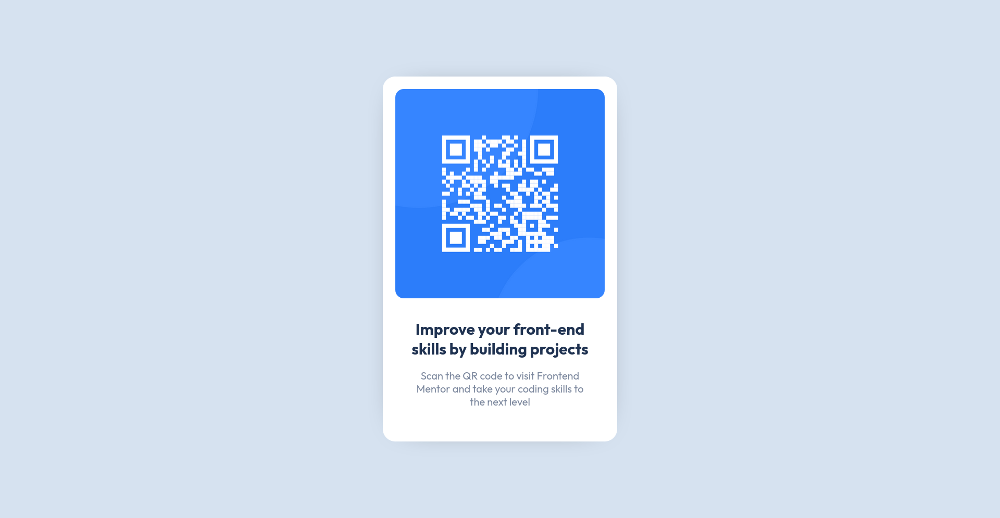

# Frontend Mentor - QR code component solution

This is a solution to the [QR code component challenge on Frontend Mentor](https://www.frontendmentor.io/challenges/qr-code-component-iux_sIO_H).  

## Table of contents

- [Overview](#overview)
  - [Screenshot](#screenshot)
  - [Links](#links)
- [My process](#my-process)
  - [Built with](#built-with)
  - [What I learned](#what-i-learned)
  - [Continued development](#continued-development)
  - [Useful resources](#useful-resources)
- [Author](#author)
- [Acknowledgments](#acknowledgments)

## Overview

### Screenshot

### Links

- Solution URL: [GitHub - OignonFugace/QR-code-component](https://github.com/OignonFugace/QR-code-component)
- Live Site URL: [Frontend Mentor | QR code component](https://oignonfugace.github.io/QR-code-component/)

## My process

### Built with

- Semantic HTML5 markup
- CSS custom properties

### What I learned

### Questions to community

### Continued development

### Useful resources

## Author

- Website - [Oignon Fugace - par Tanguy Freycon](https://oignonfugace.com/)
- Frontend Mentor - [@OignonFugace](https://www.frontendmentor.io/profile/OignonFugace)

## Acknowledgments

